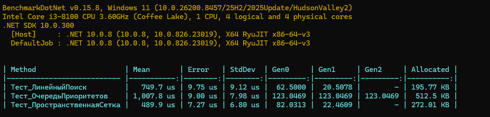
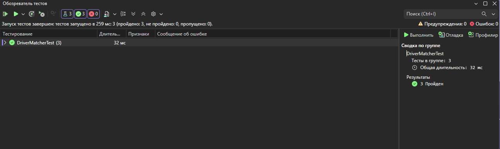

# Механизм подбора водителя на заказ

Проект реализует и тестирует три различных алгоритма поиска 5 ближайших водителей к точке заказа на прямоугольной сетке. Производительность алгоритмов оценена с помощью библиотеки BenchmarkDotNet.

## Реализованные алгоритмы
1. **Линейный поиск (Brute Force)** — базовый перебор всех водителей с полной сортировкой по расстоянию. 
2. **Очередь с приоритетом (Priority Queue)** — выбор топ-5 элементов с использованием мин-кучи без полной сортировки массива. 
3. **Пространственная сетка (Grid Bucket)** — разбиение карты на сектора для локального поиска водителей только в радиусе заказа.

Ниже представлены замеры времени и потребления памяти при симуляции 10 000 водителей на карте 1000x1000:

## Анализ результатов
* Пространственная сетка (Grid Bucket)** показала наилучшее время выполнения (516.2 us), так как успешно отсекает заведомо далеких водителей и не тратит ресурсы на лишние вычисления.
* Линейный поиск** занял второе место (762.7 us) и показал минимальное выделение памяти, однако этот алгоритм плохо масштабируется при росте базы данных.
* Очередь с приоритетом (Priority Queue)** уступила по скорости (990.1 us) из-за накладных расходов на внутреннюю балансировку дерева кучи при добавлении всех элементов.

## Тестирование
Корректность работы каждого из трех алгоритмов полностью подтверждена автоматическими юнит-тестами с использованием библиотеки NUnit. Тесты проверяют правильность сортировки и точность подбора ближайших водителей.

Все 3 теста успешно пройдены:

